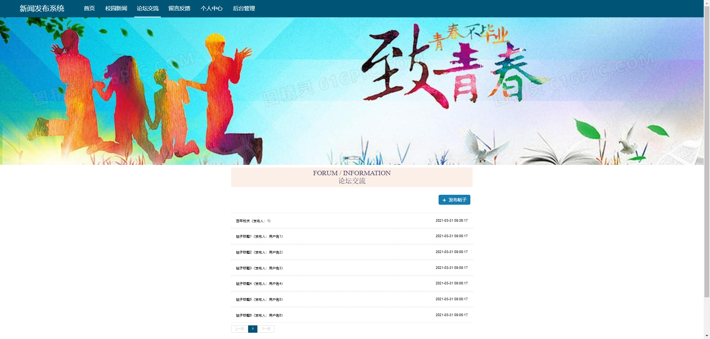

# 基于Java+SSM+Vue新闻发布系统平台(源码+数据库)

#### 作者QQ：3275035005 微信：xkbishe123 (支持修改、 部署调试、 代做接毕业设计和课程设计)

#### 网站建设、小程序、H5、APP、各种系统、样式修改、10000套源码可选。

#### 选题+开题报告+任务书+程序定制+安装调试+论文+答辩ppt 都可以做

#### 问题包修改，包满意，有需求尽管甩过来！一条龙帮你安心过！

#### 所有项目以及源代码本人均调试运行无问题 可支持远程调试运行

# 项目介绍
基于Java+SSM+Vue新闻发布系统平台-毕业设计，本系统分用户端和管理端两部分，项目采用前后端分离开发

### 1. 用户

用户登录，用户注册、查看轮播图、查看校园新闻、校园新闻搜索、新闻类型筛选、校园信息评论、论坛交流、留言反馈、个人中心、查看我的发布帖子、查看我的收藏新闻

### 2. 管理员

管理员登录、修改密码、个人信息修改、用户管理、新闻类型管理、敏感字管理、校园新闻管理、留言板管理、论坛交流管理、轮播图管理

# 技术框架
- 开发语言：Java8
- 数据库：Mysql5.7以上
- 系统环境：jdk8、maven、node
- 后端框架：Spring、SpringMvc、Mybatis
- 前端框架：Vue、ElementUI、HTML、Jquery
- 开发工具：IDEA
- 技术架构：前后端分离、B/S架构、MVC架构
# 项目截图

### 1. 用户端

### 2. 管理端

